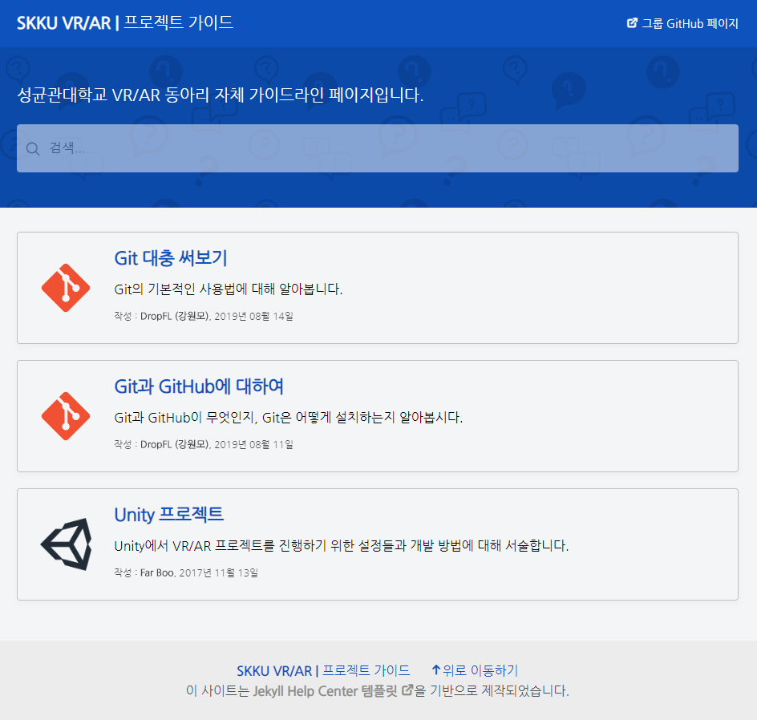
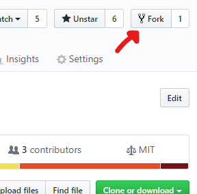

# 동아리 활동 가이드라인

## 개요

성균관대학교 VR/AR 동아리 자체 가이드라인을 작성한 웹페이지로, [GitHub Pages](https://pages.github.com/)를 기반으로 배포되고 있습니다. 페이지 구조 및 레이아웃은 [Jekyll Help Center](https://gustavoquinalha.github.io/jekyll-help-center-theme/)를 바탕으로 하고 있습니다.


**[🔗 웹페이지](https://skku-vrar.github.io/guide)**

## 설치 및 실행

GitHub Pages는 [Ruby](https://www.ruby-lang.org/ko/) 기반의 [Jekyll](https://jekyllrb.com/)을 통해 배포됩니다.

### 1. Ruby 2.6 설치

> 2020-02-09 기준 Ruby 최신 릴리즈 버전은 2.7이나, [GitHub Pages 의존성 목록](https://pages.github.com/versions/) 중 일부가 2.7 이상의 Ruby를 지원하지 않습니다. 따라서 Ruby 2.6을 설치해야 GitHub Pages 환경의 Jekyll을 테스트할 수 있습니다.

Ruby 2.6은 다음의 경로로 설치할 수 있습니다.

1. Debian 계열 Linux의 [apt](https://en.wikipedia.org/wiki/APT_(software)), macOS의 [HomeBrew](https://brew.sh/index_ko), Windows의 [Chocolatey](https://chocolatey.org/) 등의 패키지 관리자가 있다면, 이를 사용해 Ruby를 설치할 수 있습니다.
  다만 상술한대로 2.7 버전의 Ruby를 설치한 경우 문제가 발생할 수 있으므로, 패키지 관리자 내 최신 버전을 확인한 후 설치를 진행해야 합니다.

2. Windows의 경우, [RubyInstaller](https://rubyinstaller.org/)를 통해 특정 버전의 Ruby 인스톨러를 받아 설치할 수 있습니다.
  다만 Jekyll을 실행하기 위해서는 MSYS2 Devkit을 요구하므로, 설치할 때 `Ruby+Devkit`으로 시작하는 파일을 받고 Devkit을 같이 설치해야 합니다.

3. 소스코드를 직접 받아 컴파일하여 Ruby를 설치할 수 있습니다. 하지만 대부분의 경우 위의 방법들로 설치할 수 있으므로 더 언급하진 않겠습니다.

### 2. Bundler 설치

[Bundler](https://ruby-korea.github.io/bundler-site/)는 Python의 [PIP](https://pypi.org/project/pip/)과 같이 Ruby의 패키지(`gem`)를 관리해주는 프로그램입니다. 위에서 Ruby를 성공적으로 설치했다면, 간단히 다음의 커맨드로 Bundler를 설치할 수 있습니다.

```console
gem install bundler
```

### 3. 프로젝트 다운로드

프로젝트 zip 파일을 GitHub에서 다운로드 받거나, Git이 있다면 `git clone` 커맨드를 통해 프로젝트를 다운받을 수 있습니다. 어떠한 방법을 사용하더라도 실행에는 문제가 없으나, 이 프로젝트에 직접 기여하려면 Git을 사용하는 것이 좋습니다.

```console
git clone https://github.com/SKKU-VRAR/guide.git
```

### 4. 의존성 다운로드

커맨드 창에서 프로젝트 폴더를 열고, 다음의 명령을 입력하여 이 프로젝트에 필요한 라이브러리 등을 받을 수 있습니다.

```console
bundle install
```

### 5. Jekyll 실행

다음의 커맨드를 실행하면 Jekyll 서버 프로그램이 실행됩니다.

```console
bundle exec jekyll serve
```

웹 브라우저를 통해 `localhost:4000/guide/`에 접속하면 페이지를 볼 수 있습니다. (단, 자신의 컴퓨터에서만 볼 수 있습니다.)

## 기여 방법

현재 이 레포지토리에 대한 수정권한은 현재 다음의 인원에게만 부여되어 있습니다.

* [강원모](https://github.com/DropFL)
* [황준원](https://github.com/nuxlear)
* [황선홍](https://github.com/Worldeditory)
* [배준휘](https://github.com/BJH9750)
* [한종렬](https://github.com/Orb-H)

이 사이트에 추가적으로 필요한 내용이나 수정할 사항 등이 있는 경우, 다음의 방법을 사용해주시기 바랍니다.

### 레포지토리 내 이슈로 등록하기

요청 사항에 대해 잘 알지 못하는 등의 이유로 직접 내용을 작성/수정할 여력이 되지 않는 경우, 해당 레포지토리 내에 이슈로 해당 요청 사항을 등록해주시기 바랍니다. 이슈가 등록된 이후 관리자들이 작업에 착수하거나, 작업에 부가적으로 필요한 사항을 코멘트로 문의할 수 있습니다.

**✋ [이슈 등록하기](https://github.com/SKKU-VRAR/guide/issues/new)**

> 💡 이슈는 상세하게, 구체적으로 적을 수록 좋습니다.

### Fork하여 작업한 후, Pull Request 보내기

요청 사항을 직접 처리할 수 있는 능력이 있는 경우, 개인적으로 작업을 진행할 수도 있습니다.

GitHub 로그인 이후 레포지토리 링크에 접속하여 우측 상단의 `Fork` 버튼을 누르면 이 레포지토리의 **복사본**이 본인 소유가 됩니다. 이렇게 **복사된 레포지토리**에 대해서는 자신이 수정권한을 가지므로 원하는대로 작업을 할 수 있습니다.



작업이 충분히 진행되어 나온 결과물을 본 사이트에 추가하고 싶다면 **원본** 레포지토리에 **PR**(**P**ull **R**equest)을 요청하면 됩니다. 이후 관리자들이 추가 작업을 요구하거나 머지를 진행할 수 있습니다.

**📢 [PR 요청하기](https://github.com/SKKU-VRAR/guide/compare)**

> 💡 이전에 이슈를 등록했다면 PR 작성 시 설명에 해당 이슈를 언급하는 것이 좋습니다.

### 관리자 권한 요청하기

이 레포지토리를 지속적으로 유지보수하기를 원하는 경우, 다른 관리자에게 자신을 관리자로 추가하는 것을 요청할 수 있습니다. 이후 관리자들 간 충분한 논의 후 추가 여부가 결정될 수 있습니다.

> 💡 GitHub에 자신의 작업물을 올린다면 판단에 도움이 될 수 있습니다.

#### 주의사항

❗ 기존 관리자들의 의견에 따라 요청이 **거절**될 수도 있습니다.  
❗ 관리자 권한이 부여되면 이 사이트 및 레포지토리에 대한 **책임**을 지게 됩니다.

따라서 중요도가 낮은 요청은 가능하면 위에 제시된 방법을 이용하길 추천합니다.

## 라이센스

이 프로젝트는 [MIT 라이센스](https://opensource.org/licenses/MIT)로 배포되었습니다.
